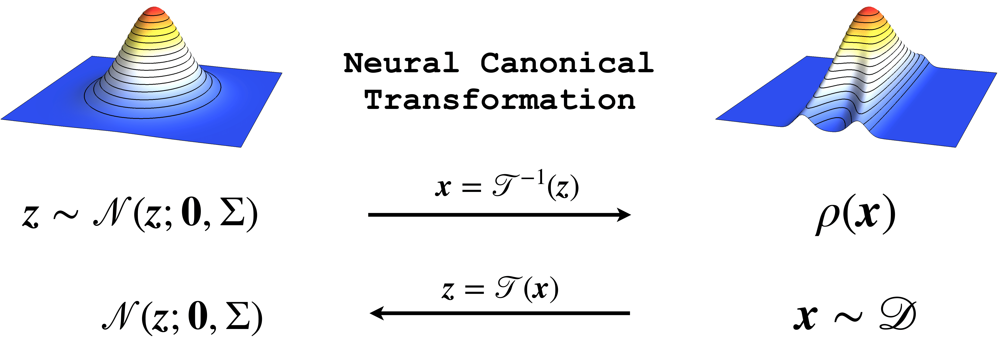

# Neural Canonical Transformation

Pytorch implement of the paper: Neural Canonical Transformation with Symplectic Flows.



In this work, we encode sympletic constrain into normalizing flow models, so that it's learned latent space has meanings defined by dynamical mechanics.

## Usage

### 1. Phase Space Density Estimation

To train a neuralCT via variational approach, use `mlmain.py`. 

**Options**

- **-epochs**: Number of epoches to train;
- **-batch**: Batch size of the training;
- **-cuda**: Which device to use with -1 standing for CPU, number bigger than -1 is N.O. of GPU;
- **-hdim**: Hidden dimension of mlps;
- **-numFlow**: Number of flows layers;
- **-nlayers**: Number of mlps layers in the rnvp;
- **-nmlp**: Number of dense layers in each mlp;
- **-n**: Number of dimensions of the training data;
- **-dataset**: Path to the training data.

To see detailed options, run`python main.py -h`.

**Example**

```bash
python ./mlmain.py -epochs 5000 -batch 200 -cuda 1 -hdim 256 -nmlp 3 -nlayers 16 -dataset ./database/mnist.npz
```

**Applications**

1. [MNIST compression](4_MNIST.ipynb)

#### 1.1 MD(special case of MLE)

To train a neuralCT for molecular dynamics, use `mdmain.py`

**Options**

- **-epochs**: Number of epoches to train;
- **-batch**: Batch size of the training;
- **-cuda**: Which device to use with -1 standing for CPU, number bigger than -1 is N.O. of GPU;
- **-hdim**: Hidden dimension of mlps;
- **-numFlow**: Number of flows layers;
- **-nlayers**: Number of mlps layers in the rnvp;
- **-nmlp**: Number of dense layers in each mlp;
- **-smile**: SMILE expression of this molecular;
- **-scaling**: Scaling factor of npz data, default is 10(for nm to ångströms);
- **-fixx/y/z**: Offset of x/y/z axis of data from npz file;
- **-dataset**: Path to the training data.

To see detailed options, run`python main.py -h`.

**Example**

```bash
python ./mdmain.py -cuda 6 -batch 200 -epoch 500 -fixy 2.3222 -dataset ./database/alanine-dipeptide-3x250ns-heavy-atom-positions.npz
```

**Applications**

1. [Alanine Dipeptide](3_AlanineDipeptide.ipynb)

### 2. Variational Free Energy

To train a neuralCT via variational approach, use `variationalMain.py`. To train on our provided target distributios, you can specify this using **-source** option. To train on a different taget distribution, you will have to code your own target, examples can be found in `source` folder.

**Options**

- **-epochs**: Number of epoches to train;
- **-batch**: Batch size of the training;
- **-cuda**: Which device to use with -1 standing for CPU, number bigger than -1 is N.O. of GPU;
- **-hdim**: Hidden dimension of mlps;
- **-numFlow**: Number of flows layers;
- **-nlayers**: Number of mlps layers in the rnvp;
- **-nmlp**: Number of dense layers in each mlp;
- **-source**: Using which source, 0 for Ring2d, 1 for HarmonicChain.

To see detailed options, run`python main.py -h`.

**Example**

```bash
python ./variationMain.py -epochs 5000 -batch 200 -cuda 1 -hdim 256 -nmlp 3 -nlayers 16 -source 0
```

**Applications**

1. [Ring2D distribution](1_Ringworld.ipynb)
2. [Harmonic Chain](2_HarmonicChain.ipynb)

## Citation

You are welcome to cite our work:

````latex
@article{neuralCT,
  Author = {Shuo-Hui Li, Linfeng Zhang, and Lei Wang},
  Title = {Neural Canonical Transformation with Symplectic Flows},
  Year = {2019},
  Eprint = {arXiv:XXXX.XXXXX},
}
````

## Contact

For questions and suggestions, contact Shuo-Hui Li at [contact_lish@iphy.ac.cn](mailto:contact_lish@iphy.ac.cn).
